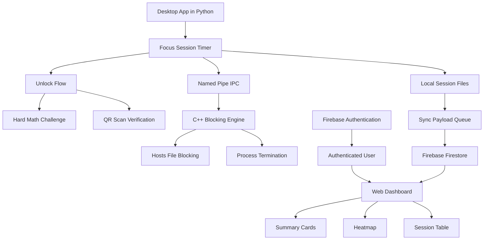

<div align="center">
  <h1>Just Do it.</h1>
  <p><strong>Focus better.</strong></p>
  <p>A strict focus timer, blocker, and analytics system built to keep deep work uninterrupted.</p>
</div>

## Table of Contents

1. [Purpose & Problem Statement](#purpose--problem-statement)
2. [Core Features](#core-features)
3. [Project Structure](#project-structure)
4. [How It Works](#how-it-works)
5. [Architecture](#architecture)
6. [Data and Storage](#data-and-storage)
7. [Technology Stack](#technology-stack)
8. [User Interface](#user-interface)
9. [Setup and Running](#setup-and-running)
10. [Hosting and Downloads](#hosting-and-downloads)
11. [Why This Is Better](#why-this-is-better)
12. [Deployment Notes](#deployment-notes)
13. [Future Scope](#future-scope)

## Purpose & Problem Statement

Most focus apps stop at a timer. This project goes further. It blocks distractions at the system level, forces a deliberate unlock challenge if you want to quit early, and records exact session behavior for later review.

The problem it solves is simple:

- People start a focus session and then drift into distractions.
- Simple timers do not create enough friction to stop early exit.
- Most tools do not record the truth of what happened during a session.
- Desktop enforcement and cloud analytics are often split into separate products.

Just Do it. combines those pieces into one system.

## Core Features

- Desktop focus timer with app and website blocking.
- Hard unlock flow using either math or QR verification.
- Exact duration tracking down to the second.
- Early termination tracking so the dashboard knows whether a session was completed or cut short.
- Firebase Authentication for login.
- Firebase Firestore for cloud session storage.
- Local JSON archives for durable session persistence and sync recovery.
- Minimal web dashboard with login, summary cards, a session table, and a GitHub-style heatmap.
- Native C++ engine for blocking websites and terminating distracting desktop apps.

## Project Structure

```text
FocusModeCLI/
├── just_do_it.py
├── engine.cpp
├── engine.exe
├── README.md
├── auth.json
├── sync_payload.json
├── local_sessions.json
├── focus_data.db
├── screen_time.log
├── secret_unlock_qr.png
└── web/
    ├── index.html
    ├── dashboard.js
    └── output-onlinepngtools.png
```

### File Roles

- `just_do_it.py` - main desktop app, Firebase auth, session timer, unlock logic, local dashboard server, and cloud sync.
- `engine.cpp` - low-level Windows blocker that manages hosts file edits, process termination, and focus mode state.
- `web/index.html` - dashboard UI, login page, summary cards, heatmap, and session table layout.
- `web/dashboard.js` - Firebase auth, Firestore reads, filtering, rendering, and heatmap generation.
- `auth.json` - local cached auth identity for the desktop app.
- `sync_payload.json` - queue of sessions waiting to be pushed to Firestore.
- `local_sessions.json` - durable local archive of completed sessions.
- `focus_data.db` - local database artifact kept in the project folder.
- `screen_time.log` - window activity trace collected by the blocker engine.
- `secret_unlock_qr.png` - generated QR image used for early unlock verification.
- `web/output-onlinepngtools.png` - bottom-left logo image used on the login page.

## How It Works

### 1. User logs in
The desktop app starts with a Firebase login screen. Once authenticated, the app stores the user identity locally and switches to the focus timer interface.

### 2. User configures a session
The user sets the focus duration, chooses blocked items, and selects the unlock penalty mode:

- Hard Math
- QR Code

### 3. Session starts
When the session begins, the Python app sends a start command to the native C++ engine through a named pipe. The engine blocks distracting sites in the Windows hosts file and kills distracting processes such as browsers and chat apps.

### 4. User tries to end early
If the user attempts to terminate a session before completion, the app does not end silently. It opens one of two deliberate unlock paths:

- **Hard Math** - a difficult arithmetic challenge using multiple random numbers.
- **QR Unlock** - a QR code is generated and scanned with the webcam to verify the unlock step.

### 5. Session is recorded
When the session ends, the app stores:

- the exact duration in seconds,
- whether it was early terminated,
- the unlock method used,
- the blocked items list,
- and screen-time traces from the engine.

### 6. Data syncs to the dashboard
The session is written to local storage first, then pushed to Firebase Firestore under the authenticated user path. The web dashboard reads that cloud data and shows the history in a clean analytics layout.

## Architecture



### Architecture Notes

- The Python app owns the user experience and session lifecycle.
- The C++ engine handles the blocking layer separately so focus enforcement stays strong.
- Local files are used as the recovery layer if cloud sync fails.
- Firebase Authentication and Firestore act as the shared online layer.
- The web dashboard is intentionally static and lightweight so it can be hosted easily.

## Data and Storage

This project behaves like a small database-backed system. It keeps a local archive and a cloud archive synchronized around the same session model.

### Session Fields

Each session stored to the dashboard includes:

- `date`
- `duration_seconds`
- `early_terminated`
- `unlock_method`
- `blocked_items`
- `screen_time`

### Storage Flow

1. A session is created in memory when the timer starts or ends.
2. The session is appended to local JSON storage.
3. Pending sessions are written to `sync_payload.json`.
4. The app pushes them to Firestore under `users/{uid}/sessions`.
5. The dashboard reads the cloud copy and renders charts, totals, and the heatmap.

### Why This Matters

The storage model is intentionally simple, but it is still reliable:

- Local JSON keeps the app usable if cloud sync is delayed.
- Firestore gives the dashboard a real authenticated backend.
- Exact seconds avoid rounding errors in reports.
- Early termination is preserved as a real field instead of being lost in a summary number.

## Technology Stack

### Desktop Application

- Python 3
- Tkinter
- `threading`
- `webbrowser`
- `http.server`
- `urllib.request`
- `json`
- `smtplib`
- `sqlite3` artifact support in the project folder

### Native Blocking Engine

- C++
- Windows API
- Named pipes
- Hosts file editing
- Process enumeration and termination

### Cloud Services

- Firebase Authentication
- Firebase Firestore
- Firebase Hosting for the dashboard when deployed online

### Web Dashboard

- HTML
- CSS
- Vanilla JavaScript
- Google Fonts Inter
- Firebase Web SDK

## User Interface

### Desktop UI

The desktop app uses a dark, high-contrast interface with:

- a centered login form,
- a circular session timer,
- duration controls,
- unlock mode radio buttons,
- blocked-item management,
- start and terminate actions,
- and a dashboard button that opens the web analytics page.

### Web UI

The dashboard uses a clean white, minimalist style with:

- a top-left brand label,
- centered login form,
- compact summary cards,
- a heatmap with month and day labels,
- a filterable session table,
- and a small footer with GitHub and policy links.

### Visual Goals

- Minimal clutter
- Sharp spacing
- Clear hierarchy
- Small borders and subtle blue accents
- No heavy visual noise

## Setup and Running

### Prerequisites

- Python 3.8 or newer
- Windows
- A C++ compiler for `engine.cpp`
- Firebase project credentials
- Optional: OpenCV and qrcode libraries for the QR unlock path

### Local Run

1. Clone the repository.
2. Make sure the C++ engine is built as `engine.exe`.
3. Run the desktop app:

```bash
python just_do_it.py
```

4. Sign in through Firebase Authentication.
5. Start a focus session and choose either Hard Math or QR Code unlock.

### Dashboard Run Only

If you only want to view the dashboard locally:

```bash
cd web
python -m http.server 8080
```

Then open:

```text
http://localhost:8080
```

### Firebase Hosting

To host the dashboard online:

1. Install Firebase CLI.
2. Run `firebase init hosting`.
3. Set the public directory to `web`.
4. Deploy with `firebase deploy --only hosting`.

## Hosting and Downloads

### Web Dashboard Hosting

The repository now includes a GitHub Pages workflow that publishes the `web/` folder automatically from the `main` branch.

To finish hosting on GitHub Pages:

1. Open the repository settings on GitHub.
2. Enable GitHub Pages with the Actions workflow as the source.
3. Add the final domain to Firebase Authentication authorized domains if you use Firebase login from that host.

If you prefer Firebase Hosting, the same `web/` folder also works there.

### Desktop App Downloads

The repository now includes a release workflow for versioned downloads.

- Push a tag such as `v1.0.0` to trigger a release build.
- The workflow packages the desktop app into `JustDoIt.exe`.
- A zip file is uploaded as the GitHub Release asset.

### What Users Download

Users only need two things:

- the hosted website for the dashboard,
- the release asset from GitHub Releases for the desktop app.

That keeps the experience simple: one site, one app download.

## Why This Is Better

- It is stricter than a normal timer because leaving early requires effort.
- It is more honest than apps that round time to the nearest minute.
- It is more useful than a timer that never stores history.
- It is more transparent than a blocker that gives no dashboard or audit trail.
- It is more complete than a single-page demo because it has enforcement, storage, auth, and analytics.

## QR and Hard Math Unlocks

These are the main control features of the project.

### Hard Math

The hard-math unlock path generates a multi-step arithmetic challenge. It is designed to be annoying enough that the user thinks twice before leaving a session early.

### QR Unlock

The QR unlock path creates a QR image, prompts the user to save it, and later scans it through the webcam to verify the unlock event.

### Why They Matter

- They introduce deliberate friction.
- They reduce impulsive termination.
- They make the focus timer act more like a commitment device.

## Deployment Notes

- The desktop app opens the local dashboard server during development.
- The same dashboard can be deployed separately as a static Firebase Hosting site.
- Cloud reads always come from Firestore using the logged-in user account.
- Local session files and sync payload files should not be committed to GitHub.

## Future Scope

- Better analytics cards on the dashboard
- Export to CSV and PDF
- More unlock modes
- Better mobile-friendly dashboard layout
- Session streak tracking
- Cloud backup for local archives
- Multi-user and team views
- Stronger reporting around focus trends

## License

This project is for educational and personal productivity use.
