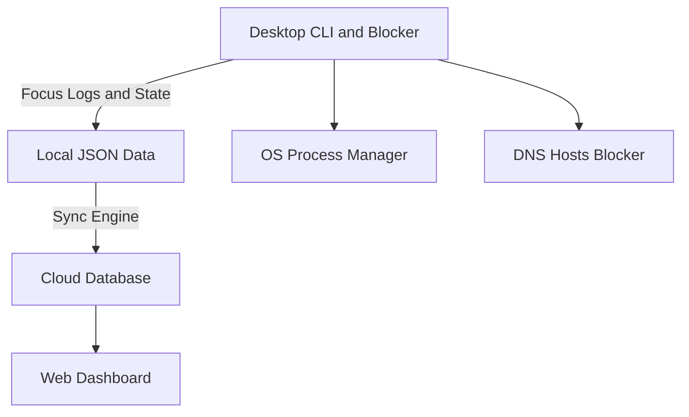



  <h1>Just Do it.</h1>
  
<b>Focus better.</b>

## Overview
Just Do it. is an uncompromising productivity suite designed to eliminate distractions. By combining aggressive desktop application and website blocking with a sleek web dashboard, it ensures you stay locked into your work. 

## ✨ Features
*   🧮 **Hard Unlocks**: Force yourself to solve complex math problems or scan a QR code placed away from your desk to unlock your machine early.
*   ⏱️ **Exact Duration Tracking**: Monitor precisely how long you stay focused down to the second.
*   ☁️ **Cloud Sync**: Synchronize your focus profiles and tracking history across multiple devices seamlessly.
*   🟩 **Activity Heatmap**: Visualize your productivity streaks with a GitHub-style contribution heatmap.

## 🏗️ Architecture

## 💻 Tech Stack
*   **Desktop Engine:** C++
*   **CLI & Logic:** Python
*   **Storage:** Local JSON & Cloud Sync
*   **Web Dashboard:** HTML, CSS, JavaScript

## 🚀 Getting Started

### Prerequisites
*   Python 3.8+
*   C++ Compiler (GCC/MSVC)

### Local Setup
1. Clone the repository.
2. Compile the core engine: `g++ engine.cpp -o engine` (or equivalent).
3. Run the CLI: `python just_do_it.py`

### Deploying Dashboard
1. Navigate to the `web/` directory.
2. Serve locally using Python: `python -m http.server 8080`.
3. Open `http://localhost:8080` in your browser.
