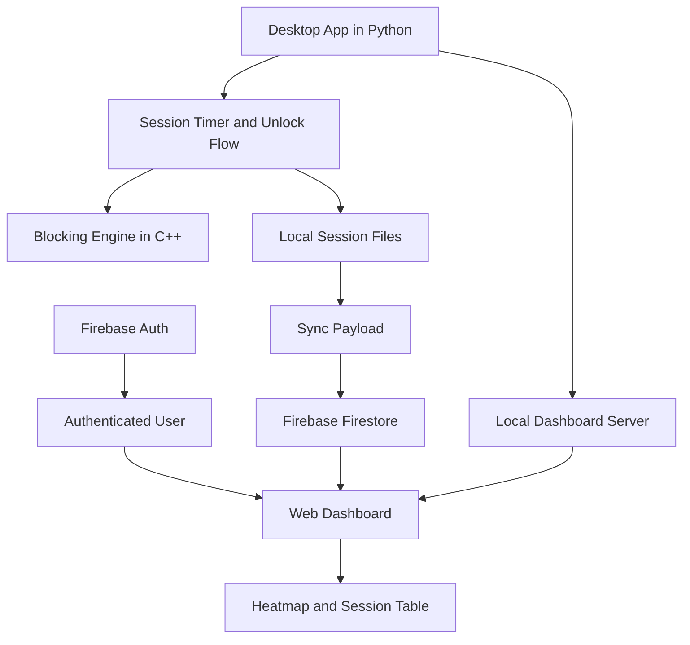



  <h1>Just Do it.</h1>
  
<strong>Focus better.</strong>

  
A strict focus timer, blocker, and analytics suite built to keep attention locked in.

## Overview
Just Do it. is a two-part productivity system:

1. A desktop application that starts a focus session, blocks distracting sites and apps, and enforces an unlock challenge.
2. A minimal web dashboard that stores and visualizes session history with a clean heatmap and a session table.

The project is intentionally narrow in scope. It does not try to be a general task manager. It exists to do one thing well: create friction between you and distraction.

## What It Includes

- Desktop focus timer with blocking rules for websites and desktop apps.
- Early unlock challenge using math or QR-based verification.
- Exact session duration tracking down to the second.
- Local session persistence plus cloud sync to Firebase.
- Web dashboard with login, analytics cards, a filterable session table, and a GitHub-style heatmap.
- A lightweight local dashboard server used by the desktop app for quick access.

## Repository Layout

- `just_do_it.py` - main Python app, session flow, auth, sync, and local dashboard server.
- `engine.cpp` - native blocking engine used for low-level enforcement.
- `web/index.html` - dashboard layout and all page styling.
- `web/dashboard.js` - dashboard logic, Firebase auth, Firestore reads, filtering, and heatmap rendering.
- `auth.json` - local auth cache used by the desktop app.
- `sync_payload.json` - pending sync payload for cloud upload.
- `local_sessions.json` - durable local archive of sessions.
- `README.md` - project documentation.

## How It Works

### 1. Login and session creation
The desktop app opens with a login screen. A user signs in or signs up with Firebase Authentication. The app stores the signed-in identity locally so the desktop flow can continue without repeating the setup every time.

### 2. Starting a focus session
When a session starts, the Python app:

- records the intended duration,
- starts the blocking logic,
- tracks elapsed time,
- and keeps the machine locked into the chosen focus window.

### 3. Early unlock flow
If the user ends a session early, the app does not just mark it complete. It records the exact number of seconds completed and flags the session as early terminated. That gives the history page real behavioral data instead of rounded, misleading durations.

### 4. Sync and storage
Each finished session is written to the local archive and also prepared for cloud sync. The sync payload is pushed into Firebase Firestore under the signed-in user's document path.

### 5. Dashboard reading
The web dashboard reads the authenticated user's sessions from Firestore and renders:

- a compact summary card for total sessions,
- a compact summary card for focus time,
- a heatmap for daily activity,
- and a session table with date, duration, unlock method, and early termination status.

## Architecture

### Architecture Notes
- The desktop app owns the enforcement and session lifecycle.
- The C++ engine handles blocking at a lower level than the UI layer.
- The local JSON files keep the system resilient when sync is delayed.
- Firebase Auth and Firestore provide the shared cloud layer for the dashboard.
- The web dashboard is deliberately static and lightweight so it can be hosted easily.

## Tech Stack

### Desktop Layer
- Python 3
- Tkinter
- ctypes
- threading
- webbrowser
- http.server
- urllib.request
- json

### Native Enforcement Layer
- C++
- Process control and system blocking

### Cloud Layer
- Firebase Authentication
- Firebase Firestore
- Firebase Hosting for the dashboard when deployed

### Web Dashboard
- HTML
- CSS
- Vanilla JavaScript
- Inter font from Google Fonts

## Why This Approach Is Better

- It is stricter than typical timers because it combines a timer with actual blocking and unlock friction.
- It is more honest than simple minute counters because it records exact completed seconds and early termination.
- It is easier to inspect than an opaque native-only app because the dashboard exposes history clearly.
- It is more portable than a desktop-only tracker because the data syncs into a web layer.
- It is simpler than a full task-management suite because it focuses on one job: protecting deep work.

## Data Model

Each session generally includes:

- `date`
- `duration_seconds`
- `early_terminated`
- `unlock_method`
- `blocked_items`
- `screen_time`

That structure keeps the dashboard flexible enough to show exact duration, daily contribution totals, and unlock behavior.

## Getting Started

### Prerequisites
- Python 3.8 or newer
- A C++ compiler such as MSVC or GCC
- A Firebase project for auth and Firestore

### Local Run
1. Clone the repository.
2. Compile the blocking engine if needed: `g++ engine.cpp -o engine`.
3. Start the desktop app: `python just_do_it.py`.
4. Open the dashboard from the desktop app.

### Web Dashboard Only
1. Open the `web/` folder.
2. Serve it with any static host or local server.
3. Sign in with Firebase Authentication.
4. The dashboard will pull your sessions from Firestore.

### Firebase Deployment
1. Install Firebase CLI.
2. Run `firebase init hosting`.
3. Set the public directory to `web`.
4. Deploy with `firebase deploy --only hosting`.

## Notes

- The repo is designed to work as a local desktop app and as a separate cloud dashboard.
- Local JSON files are useful for resilience, debugging, and recovery.
- If you change the Firestore schema, keep the dashboard renderer and sync payload in sync.
