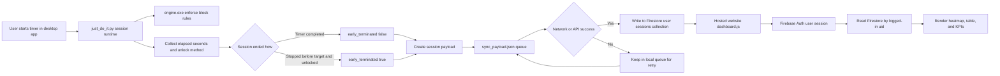

# Just Do It

Strict focus suite with:

- a Windows desktop timer app,
- a native blocking engine,
- Firebase-backed cloud sync,
- and a hosted web dashboard.

## What this project does

- Starts focus sessions with website/app blocking.
- Forces intentional early exit via one unlock method:
	- Hard Math challenge, or
	- QR challenge.
- Tracks exact focus duration in seconds.
- Marks sessions as early terminated when closed before target duration.
- Syncs session records to Firestore.
- Shows stats in a web dashboard (heatmap + session table).

## Quick start for normal users

If you are just using the app, this is the only section you need.

### 1. Clone and install

```powershell
git clone https://github.com/letsjoyn/just-do-it.git
cd just-do-it
py -m pip install --upgrade pip
py -m pip install qrcode[pil] opencv-python pygame
```

### 2. Run as Administrator

Open PowerShell as Administrator, then:

```powershell
cd path\to\just-do-it
py just_do_it.py
```

Admin rights are required because the engine can update host blocking and manage blocked processes.

### 3. Sign up / login in app

- Enter email + password in the desktop app.
- Use the same account later on the website dashboard.

### 4. Start a focus session

1. Set timer duration.
2. Choose unlock mode:
	 - `math`: solve a generated hard expression.
	 - `qr`: show your secret unlock QR to webcam.
3. Click Start.

### 5. During a running session

- Blocker engine enforces configured restrictions.
- Timer counts down in app.
- Screen usage is sampled for logging.

### 6. Ending a session

- Full completion: when timer hits zero, session is logged as normal (`early_terminated = false`).
- Early close: click Stop and complete your chosen unlock challenge. Session is logged with actual elapsed seconds and `early_terminated = true`.

### 7. Open dashboard

- Click Dashboard in the app, or open:
	- `https://just-do-it-1fa38.web.app`
- Login using the same account.
- Dashboard shows:
	- logged-in email in header,
	- total sessions,
	- total focus duration,
	- activity heatmap,
	- session table with Date, From-To, Duration, Unlock Method, Early Term.

## Full architecture

## Components

- `just_do_it.py`
	- Desktop UI (Tkinter), auth calls, timer lifecycle, session logging, cloud sync queue handling.
- `engine.cpp` / `engine.exe`
	- Native enforcement engine (blocking/unblocking behavior).
- `web/index.html`
	- Login + dashboard UI shell.
- `web/dashboard.js`
	- Firebase Auth state, Firestore read, KPI/heatmap/table rendering.
- Firebase Authentication
	- User identity for both desktop app and website.
- Firestore
	- Source of truth for synced sessions.
- Firebase Hosting
	- Serves website dashboard.

## Data flow (local -> cloud -> website)



## Runtime sequence details

### Desktop side

1. User authenticates in app.
2. App starts timer and notifies engine to enforce restrictions.
3. On completion or successful unlock termination:
	 - App computes `duration_seconds`.
	 - App sets `early_terminated` accurately.
	 - App prepares session payload.
4. App attempts Firestore write.
5. If cloud write fails, session stays in local queue for later retry.

### Website side

1. User logs in on hosted dashboard.
2. `dashboard.js` watches Firebase Auth state.
3. On authenticated state:
	 - hides login-only note/footer,
	 - shows dashboard and user email,
	 - fetches sessions from `users/{uid}/sessions` ordered by date.
4. UI computes:
	 - total sessions,
	 - total duration,
	 - heatmap intensity,
	 - table rows including Date and From-To range.

## Session schema

Each stored session includes (primary fields):

- `date`: end timestamp of session
- `duration_seconds`: actual elapsed duration in seconds
- `early_terminated`: boolean
- `unlock_method`: `math` or `qr`
- `blocked_items`: blocked targets list used by session
- `screen_time`: captured activity sample metadata

## Local files generated at runtime

- `auth.json`
	- Local auth metadata/token cache.
- `sync_payload.json`
	- Pending unsynced queue (retry source).
- `local_sessions.json`
	- Local archive copy.
- `screen_time.log`
	- Foreground/app activity capture log.
- `secret_unlock_qr.png`
	- Generated QR for QR unlock mode.

Note: runtime files should not be committed.

## Repository map

```text
just_do_it.py                Desktop app, timer, auth, sync
engine.cpp                   Native blocker engine source
engine.exe                   Built blocker engine binary
web/index.html               Dashboard page structure/styles
web/dashboard.js             Dashboard data/auth/render logic
web/output-onlinepngtools.png  Meme asset
firebase.json                Hosting config
.firebaserc                 Firebase project mapping
```

## Maintainer operations

## Deploy website

```powershell
firebase login
firebase use just-do-it-1fa38
firebase deploy --only hosting
```

## Local website test (optional)

From project root, serve `web/` using any static server, then open browser.

## Troubleshooting

## Early termination showing wrong state

- Fixed logic now snapshots elapsed time when termination is requested and logs `early_terminated=true` if user closes before target.
- Ensure you are running latest `just_do_it.py`.

## Dashboard shows no data

- Confirm app and website use the same Firebase account.
- Confirm Firestore rules allow authenticated reads/writes for that user path.
- Confirm sessions exist in `users/{uid}/sessions`.

## Smart App Control / unsigned binary issues

- Run from source with Python (recommended).
- Prefer Administrator shell for full blocking support.

## Notes

- Current app Dashboard button opens hosted site:
	- `https://just-do-it-1fa38.web.app`
- Release automation workflows were intentionally removed to reduce noisy failures.

