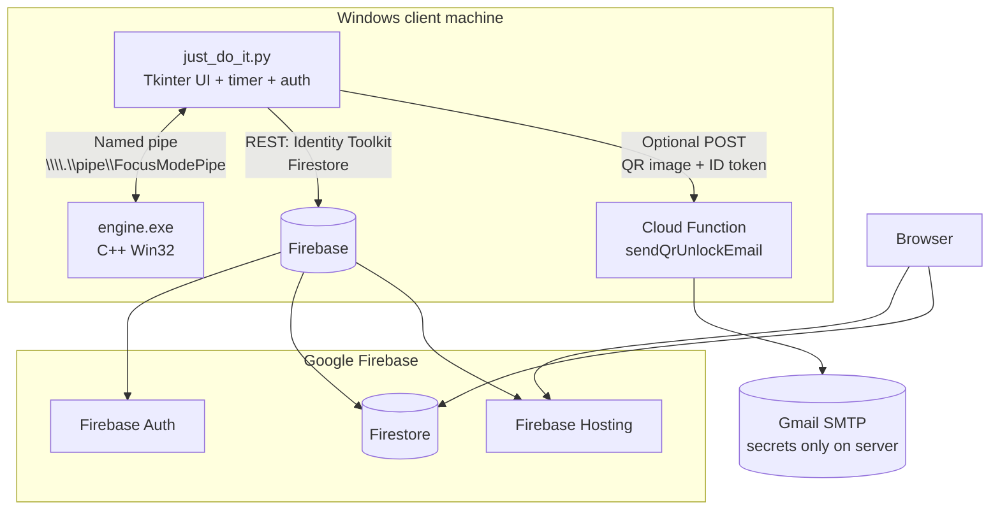
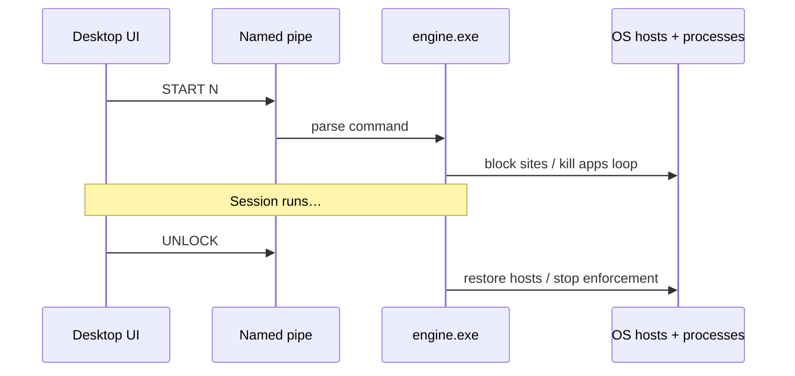
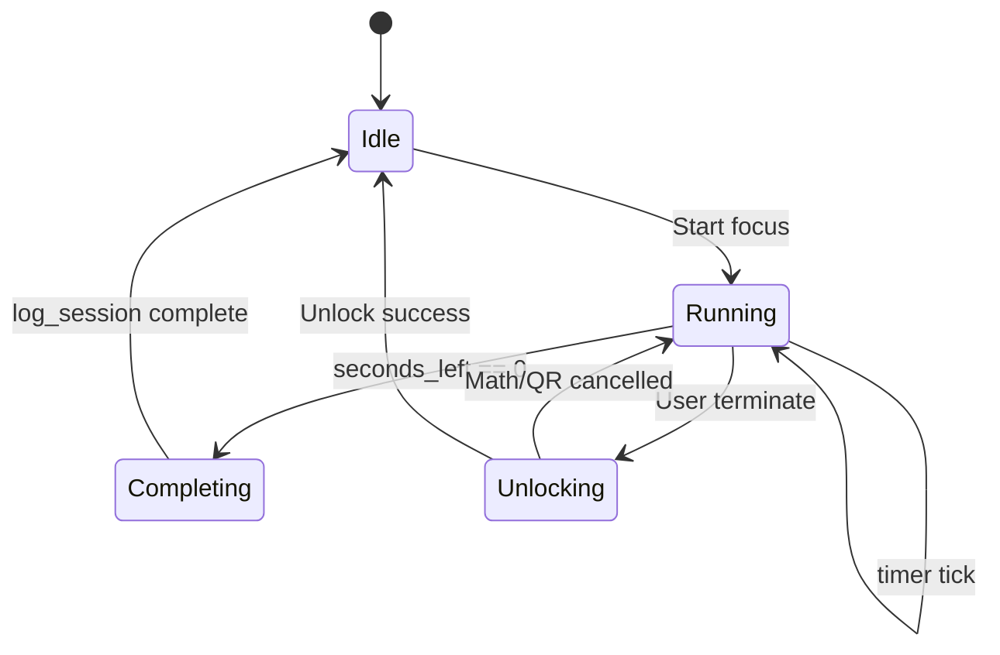
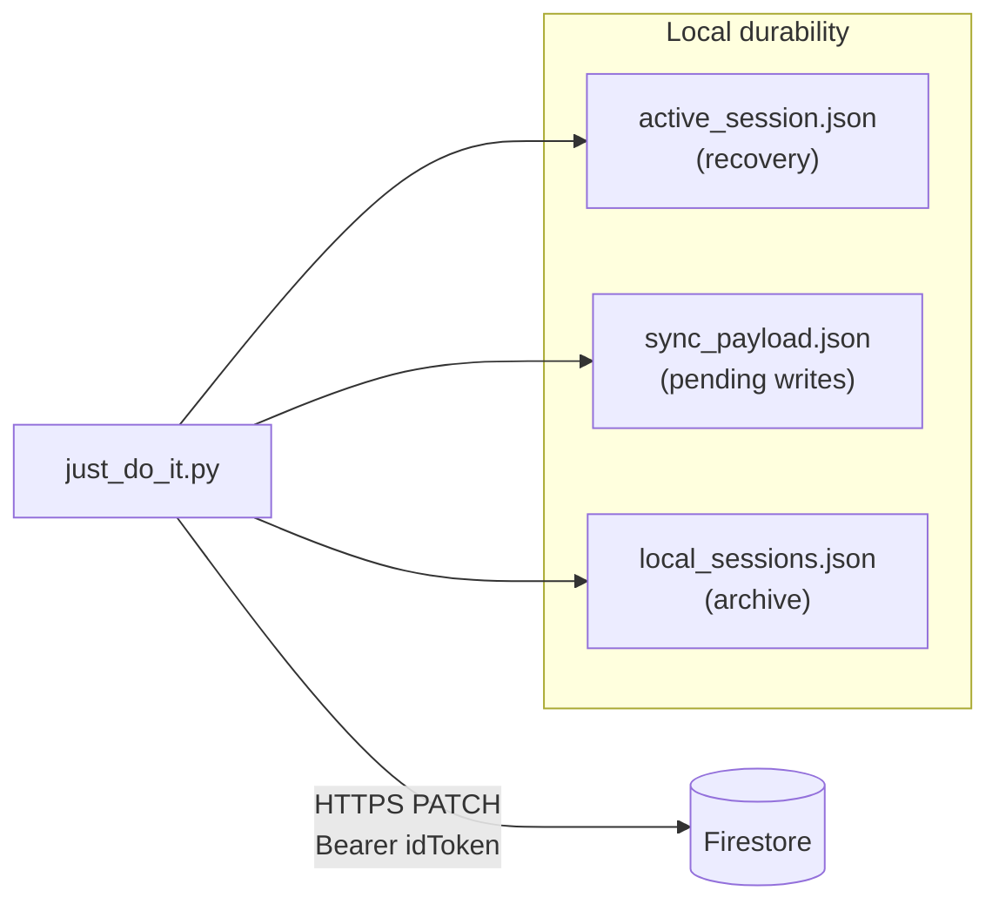
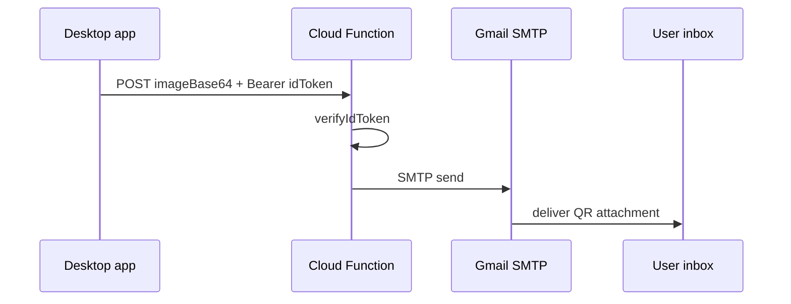

# Just Do It

A **Windows-first focus suite**: a Python desktop client coordinates a **native blocking engine**, **Firebase** auth and cloud sync, and a **static web dashboard** for history and stats. Early exit from a session requires an explicit **unlock penalty** (hard math or QR + webcam).

---

## Table of contents

- [Overview](#overview)
- [Architecture](#architecture)
- [System design](#system-design)
- [Data model](#data-model)
- [Security model](#security-model)
- [Tech stack](#tech-stack)
- [Getting started](#getting-started)
- [If you cloned this repository](#if-you-cloned-this-repository-end-user-path)
- [Optional: QR email (Cloud Function)](#optional-qr-email-cloud-function)
- [Deployment](#deployment)
- [Repository layout](#repository-layout)
- [Known limitations & audit notes](#known-limitations--audit-notes)

---

## Overview

| Capability | Description |
|------------|-------------|
| **Focus sessions** | User-defined duration; countdown and progress ring in Tkinter UI. |
| **Enforcement** | Native `engine.exe` applies **hosts-file redirects** for blocked sites and **terminates** configured processes on an interval while focus is active. |
| **Early exit** | **Math**: solve a generated expression, or close the dialog to **resume** the session. **QR**: webcam decodes payload `UNLOCK_FOCUS`; optional **email QR** via HTTPS (no SMTP secrets in the client). |
| **Persistence** | Sessions synced to **Firestore** under `users/{uid}/sessions/{id}`; local queue (`sync_payload.json`) for offline retry; `local_sessions.json` archive. |
| **Dashboard** | Firebase-hosted SPA (`web/`) reads the same Firestore tree for KPIs, heatmap, and session table. |

**Constraints:** the desktop app expects **Administrator** elevation on Windows so the engine can modify `hosts` and manage processes. This is a **personal productivity** tool, not enterprise endpoint security.

---

## Architecture

High-level view: **three runtimes** (desktop UI, native engine, cloud) connected by **IPC**, **HTTPS**, and **Firebase**.


```mermaid
flowchart TB
  subgraph client ["Windows client machine"]
    UI["just_do_it.py\nTkinter UI + timer + auth"]
    ENG["engine.exe\nC++ Win32"]
    UI <-->|"Named pipe\n\\\\.\\pipe\\FocusModePipe"| ENG
    UI -->|"REST: Identity Toolkit\nFirestore"| FB[(Firebase)]
    UI -->|"Optional POST\nQR image + ID token"| CFN["Cloud Function\nsendQrUnlockEmail"]
  end
  subgraph firebase ["Google Firebase"]
    FB --> AUTH[Firebase Auth]
    FB --> FS[(Firestore)]
    FB --> HOST[Firebase Hosting]
  end
  CFN --> SMTP[(Gmail SMTP\nsecrets only on server)]
  BROWSER["Browser"] --> HOST
  BROWSER --> FS
```

### Layered responsibilities

| Layer | Responsibility |
|-------|------------------|
| **Presentation** | Tkinter: login, timer, blocked list, unlock flows, local HTTP server for optional local dashboard assets. |
| **Domain / orchestration** | Session lifecycle, `early_terminated` semantics, sync queue, recovery from `active_session.json`. |
| **Enforcement** | `engine.exe`: pipe server loop, hosts markers, process sweep, optional foreground logging. |
| **Platform** | Win32 named pipes, `hosts`, process APIs; Python `ctypes` for admin gate and optional audio (MCI). |
| **Cloud** | Firebase Auth (email/password), Firestore documents, Hosting for `web/`; optional Node function for transactional email. |

---

## System design

### 1. Desktop ↔ engine IPC

Communication uses a **Windows named pipe** as a simple message channel (the Python side writes command strings; the engine parses them on the server loop).

**Engine-supported commands** (see `engine.cpp`):

| Command | Effect |
|---------|--------|
| `START <minutes>` | Loads `blocked_items.json` adjacent to `engine.exe`, enables focus mode, appends **hosts** block section, arms background enforcement. |
| `UNLOCK` | Disables focus mode, removes hosts block section, clears internal timers. |
| `STATUS` | Returns remaining time or `IDLE`. |

The UI also uses a lightweight `send_ipc` helper for **watchdog** behavior during a session (restart `engine.exe` if the child process or pipe appears unhealthy).


```mermaid
sequenceDiagram
  participant UI as Desktop UI
  participant Pipe as Named pipe
  participant ENG as engine.exe
  participant OS as OS hosts + processes
  UI->>Pipe: START N
  Pipe->>ENG: parse command
  ENG->>OS: block sites / kill apps loop
  Note over UI,ENG: Session runs…
  UI->>Pipe: UNLOCK
  ENG->>OS: restore hosts / stop enforcement
```

**Design choice:** split **UI** and **engine** so enforcement can survive UI hiccups in some failure modes, and so privileged operations stay in a small native binary. Tradeoff: two processes to deploy and version together.

### 2. Session lifecycle (desktop)


```mermaid
stateDiagram-v2
  [*] --> Idle
  Idle --> Running: Start focus
  Running --> Running: timer tick
  Running --> Completing: seconds_left == 0
  Running --> Unlocking: User terminate
  Unlocking --> Running: Math/QR cancelled
  Unlocking --> Idle: Unlock success
  Completing --> Idle: log_session complete
```

- **Normal completion:** `finish()` → `log_session(duration, early_terminated=false)` → `UNLOCK` → open dashboard URL.
- **Early terminate:** timer frozen → unlock UI → on success `log_session(elapsed, early_terminated=true)` → `UNLOCK`.

### 3. Cloud sync (desktop → Firestore)

The desktop app uses **Firebase Auth REST** (`signUp` / `signInWithPassword`) for tokens, then **Firestore REST** `PATCH` with `Authorization: Bearer <idToken>` to write `users/{uid}/sessions/{sessionId}`.


```mermaid
flowchart LR
  subgraph offline ["Local durability"]
    A["active_session.json\n(recovery)"]
    Q["sync_payload.json\n(pending writes)"]
    L["local_sessions.json\n(archive)"]
  end
  UI2["just_do_it.py"] --> A
  UI2 --> Q
  UI2 --> L
  UI2 -->|"HTTPS PATCH\nBearer idToken"| FS2[(Firestore)]
```

**Offline / failure:** failed writes remain in `sync_payload.json`; on next successful login / UI load, a **retry** path can flush the queue (see implementation in `just_do_it.py`).

**Document IDs:** deterministic `s_{unix_ts}` from session end timestamp to make retries **idempotent** (same logical session maps to the same document).

### 4. Web dashboard

`web/dashboard.js` uses the **Firebase JS SDK** (`signInWithEmailAndPassword`, `getFirestore`, `collection("users", uid, "sessions")`, `orderBy("date", "desc")`). The UI is static files on **Firebase Hosting**; all **authorization** is enforced by **Firestore security rules** (must allow authenticated reads/writes on the user’s subtree).

### 5. QR email (optional)

End users must **not** embed a shared Gmail App Password in the desktop binary. Optional flow:

1. User taps **EMAIL QR TO ME** in the QR setup window.
2. Client `POST`s PNG (base64) + `Authorization: Bearer <idToken>` to **`sendQrUnlockEmail`** (Cloud Function).
3. Function verifies the token and sends mail **only** to `decoded.email` using **server-side secrets** (`GMAIL_USER`, `GMAIL_APP_PASSWORD`).


```mermaid
sequenceDiagram
  participant App as Desktop app
  participant CF as Cloud Function
  participant GA as Gmail SMTP
  participant Inbox as User inbox
  App->>CF: POST imageBase64 + Bearer idToken
  CF->>CF: verifyIdToken
  CF->>GA: SMTP send
  GA->>Inbox: deliver QR attachment
```

---

## Data model

### Firestore: `users/{uid}/sessions/{sessionId}`

| Field | Type | Meaning |
|-------|------|---------|
| `date` | string (ISO 8601) | Session end instant (UTC `Z`). |
| `duration_seconds` | int | Elapsed focus time logged for that session. |
| `early_terminated` | bool | `true` if user stopped before target and completed unlock. |
| `unlock_method` | string | `math` or `qr`. |
| `blocked_items` | array of strings | Domains / exe names used for that session. |
| `screen_time` | map (optional) | Aggregated foreground samples from engine log pipeline. |

### Local files (runtime; do not commit)

| File | Role |
|------|------|
| `auth.json` | Cached Firebase id token metadata for auto-login. |
| `active_session.json` | Crash / relaunch recovery for in-progress session. |
| `sync_payload.json` | Pending Firestore writes. |
| `local_sessions.json` | Local archive mirror. |
| `blocked_items.json` | Shared with engine: block list. |
| `secret_unlock_qr.png` | QR asset for webcam unlock. |

---

## Security model

| Topic | Approach |
|-------|----------|
| **User secrets** | Firebase password only sent to Google Identity Toolkit over TLS; not stored in repo. |
| **Desktop → Firestore** | Writes use short-lived **ID token** in `Authorization` header; access bounded by **Firestore rules** (users may only touch their own `users/{uid}/...`). |
| **QR email** | **No** shared SMTP password in the client; optional Cloud Function holds Gmail **secrets** and verifies **ID token** before send. |
| **Hosts / process control** | High privilege by design; requires **Administrator**; users must trust the binary they run. |
| **Threat model** | A malicious or tampered `engine.exe` could harm the machine—treat distribution like any privileged software (sign builds, publish checksums, code review). |

---

## Tech stack

| Area | Technology |
|------|------------|
| Desktop UI | Python 3, Tkinter |
| Native engine | C++ (Win32), MSVC or MinGW |
| Auth / DB / hosting | Firebase Auth, Firestore, Firebase Hosting |
| Dashboard | Vanilla ES modules + Firebase JS SDK 10.x |
| Optional mail | Firebase Cloud Functions (Node 20), `nodemailer`, Gmail SMTP |
| IPC | Windows named pipe `\\.\pipe\FocusModePipe` |

---

## Getting started

### Prerequisites

- **Windows** (primary supported platform).
- **Python 3.11 or 3.12** recommended (dependency wheels are more reliable than very new Python releases).
- **Administrator** shell for full blocking behavior.

### Install Python dependencies

```powershell
py -m pip install "qrcode[pil]" opencv-python
```

### Engine binary

This repository includes a prebuilt **`engine.exe`** (Windows) next to `just_do_it.py`, so a normal **`git clone`** already has the engine. Rebuild only if you change `engine.cpp`:

```powershell
# MSVC Developer shell (example)
cl /EHsc /O2 engine.cpp /Fe:engine.exe
```

### Run

```powershell
cd path\to\just-do-it
py just_do_it.py
```

Sign in with the same Firebase email/password you use on the hosted dashboard.

### Dashboard URLs

- **Hosted:** `https://just-do-it-1fa38.web.app`
- **Local (optional):** the desktop app serves `web/` on `http://127.0.0.1:8765` for development.

### Firestore rules

Rules must allow authenticated users to read/write their own documents, for example:

```text
match /users/{userId}/sessions/{sessionId} {
  allow read, write: if request.auth != null && request.auth.uid == userId;
}
```

Avoid time-bounded “open” rules that expire and **deny all traffic** after a date.

---

## If you cloned this repository (end-user path)

Use this flow if you only want to **run the app** after cloning from GitHub (Windows).

### 1. Clone

```powershell
git clone https://github.com/letsjoyn/just-do-it.git
cd just-do-it
```

You should see **`engine.exe`** and **`just_do_it.py`** in the same folder (the engine is **not** “already running”; the Python app **starts** `engine.exe` when it launches).

### 2. Install Python (if you do not have it)

Install **Python 3.11 or 3.12** from [python.org](https://www.python.org/downloads/) (or the Microsoft Store). Then install dependencies:

```powershell
py -m pip install "qrcode[pil]" opencv-python
```

If `py` is not found, try `python -m pip ...`.

### 3. Run as Administrator

1. Open **PowerShell** or **Command Prompt** as **Administrator** (right-click → *Run as administrator*).
2. `cd` into the cloned folder.
3. Start the app:

```powershell
py just_do_it.py
```

Without Administrator elevation, the app exits: blocking needs permission to update `hosts` and manage processes.

### 4. Inside the app

1. **Sign up or log in** with email + password (same account as the web dashboard below).
2. Set **duration**, choose **Math** or **QR** unlock mode, then **START**.
3. **QR mode:** save or photograph the QR; use **EMAIL QR TO ME** only if the maintainer deployed the Cloud Function and configured the URL (see [optional QR email](#optional-qr-email-cloud-function)).
4. **End session:** let the timer finish, or **Terminate** and complete the unlock challenge.

### 5. View stats in the browser

Open **`https://just-do-it-1fa38.web.app`**, sign in with the **same** email/password as the desktop app.

### Common issues

| Symptom | Likely cause |
|---------|----------------|
| App closes immediately | Not running **as Administrator**. |
| “Engine offline” / weak blocking | `engine.exe` missing or blocked by AV; ensure it sits next to `just_do_it.py`. |
| Webcam / QR errors | Install **opencv-python**; allow **camera** in Windows *Settings → Privacy → Camera*. |
| “Email QR” warns not configured | Cloud Function URL not set (`JUSTDOIT_QR_MAIL_URL` or baked default in code). |
| Dashboard empty / permission error | Wrong account, or Firestore **rules** too strict / expired open rules. |

---

## Optional: QR email (Cloud Function)

1. `cd functions && npm install && cd ..`
2. Set secrets (sender Gmail + [App Password](https://support.google.com/accounts/answer/185833)):

   ```powershell
   echo you@gmail.com | firebase functions:secrets:set GMAIL_USER
   echo your16charAppPass | firebase functions:secrets:set GMAIL_APP_PASSWORD
   firebase deploy --only functions
   ```

3. Configure the desktop app with the deployed **HTTPS URL**:

   ```powershell
   $env:JUSTDOIT_QR_MAIL_URL = "https://<your-function-url>"
   py just_do_it.py
   ```

Or bake the URL as the default for `QR_EMAIL_CLOUD_URL` in `just_do_it.py` for end-user builds.

**Billing note:** outbound SMTP from Cloud Functions typically requires the Firebase project on the **Blaze** (pay-as-you-go) plan. Set **budget alerts** in Google Cloud Billing. Gmail also enforces **daily send limits** per sender.

---

## Deployment

| Target | Command |
|--------|---------|
| Hosting only | `firebase deploy --only hosting` |
| Functions only | `firebase deploy --only functions` |
| Both | `firebase deploy --only functions,hosting` |

Project ID in this repo: **`just-do-it-1fa38`** (see `.firebaserc`).

### CI/CD (GitHub Actions)

On every **pull request** and **push** to `main`, [`.github/workflows/firebase-ci-cd.yml`](.github/workflows/firebase-ci-cd.yml) runs:

| Job | When | What it does |
|-----|------|----------------|
| **ci** | PR + push | Validates `firebase.json`, `py_compile` on `just_do_it.py`, `npm ci` + `node --check` in `functions/`. |
| **deploy-hosting** | Push to `main` or **Run workflow** | Deploys **`web/`** to **Firebase Hosting** (same as `firebase deploy --only hosting`). |

**One-time GitHub setup** (otherwise the deploy job fails):

1. In [Google Cloud Console](https://console.cloud.google.com/) (same project as Firebase), open **IAM & Admin → Service Accounts** (or Firebase → Project settings → Service accounts).
2. Create or pick a service account used for CI. Grant it at least **Firebase Hosting Admin** on project `just-do-it-1fa38` (or a broader role like **Editor** if you prefer).
3. **Keys → Add key → JSON** and download the file.
4. In GitHub: **Repository → Settings → Secrets and variables → Actions → New repository secret**.
   - Name: **`FIREBASE_SERVICE_ACCOUNT_JSON`**
   - Value: paste the **entire** JSON file contents.

After that, **every push to `main` on `letsjoyn/just-do-it`** updates the live site automatically. **Pull requests** only run **ci** (no deploy). You can also run **Deploy** manually from the **Actions** tab (**Run workflow**).

**Forks:** the workflow deploy step is gated to `github.repository == 'letsjoyn/just-do-it'` so forks do not attempt deploy with a missing secret. Change that line if you rename the repo or want deploy from a fork (and add the same secret there).

**Functions** are not deployed by this workflow (hosting only). Deploy functions manually with `firebase deploy --only functions`, or extend the workflow with an extra step when you are ready.

**Troubleshooting:** if deploy fails with `firebaseServiceAccount` / missing input, the secret is empty or misnamed — use **`FIREBASE_SERVICE_ACCOUNT_JSON`** under **Settings → Secrets and variables → Actions**. The workflow uses a small **gate** job (because GitHub does not allow `secrets` inside step `if:` expressions).

---

## Repository layout

| Path | Role |
|------|------|
| `just_do_it.py` | Desktop application: UI, timer, Firebase auth/sync, QR flows, optional mail client → Cloud Function. |
| `engine.cpp` / `engine.exe` | Enforcement: hosts manipulation, process blocking, pipe server, background logging. |
| `web/` | Dashboard: `index.html`, `dashboard.js`, assets. |
| `functions/` | `sendQrUnlockEmail` HTTPS handler + Gmail SMTP (secrets). |
| `firebase.json` / `.firebaserc` | Hosting + Functions configuration. |
| `.github/workflows/firebase-ci-cd.yml` | GitHub Actions: CI + Firebase Hosting deploy. |

---

## Design philosophy

- **Friction over “unhackability”:** motivated users can always force-kill processes; the product aims for **intentional** early exit (unlock), not kernel-level unkillable locks.
- **Least exposure of secrets:** shared mail credentials live **only** on the server when using the optional function path.
- **Honest sync:** local queue + idempotent document IDs so transient network or rule failures do not silently drop sessions.

---

## Known limitations & audit notes

These are **intentional tradeoffs**, **acceptable for a personal tool**, or **follow-up work**—not a claim that every line is bug-free.

### Circumvention (by design, not “bugs”)

| Vector | Why it still “works” that way |
|--------|------------------------------|
| **Task Manager / End task** | The OS can always stop user processes. There is no supported way to make a consumer app unkillable. |
| **Edit `hosts` / kill `engine.exe` manually** | Anyone with **Administrator** can undo enforcement the same way the app applies it. |
| **Skip unlock** | If the user never completes **Terminate** + unlock, they should **not** get a clean early exit; killing the app bypasses logging by definition. |

### Technical gaps worth fixing later

| Area | Risk | Notes |
|------|------|--------|
| **Firebase ID token lifetime** | After ~**1 hour**, REST `PATCH` to Firestore can fail until the user signs in again. The SDK web client refreshes tokens automatically; the **desktop app does not** refresh today. |
| **Session document ID** | **Collision** if two sessions end in the same UTC second (`s_{unixTs}`) — rare but possible; could append random suffix. |
| **Sync queue** | On first failed write, the loop **`break`s** and leaves remaining rows in `sync_payload.json` until the next flush trigger (e.g. another session end or startup retry). |
| **QR scan loop** | OpenCV runs on the **main Tk thread** during early exit — the window may show “**Not responding**” while the camera loop runs. |
| **Local dashboard server** | Serves `auth.json` (and other files) on **`127.0.0.1`** — any **local** process could request that URL; treat the machine as trusted. |
| **Public HTTP function URL** | If deployed with **public invoke**, rely on **Bearer token** verification; consider **rate limits** / abuse monitoring for cost. |
| **Shared Firebase project** | Cloners use the **same** project/config as upstream until they fork and replace keys — fine for demos, wrong for untrusted multi-tenant SaaS. |

### Minor / cosmetic

- **`send_ipc("PING")`** is only a “can we open the pipe?” probe; the engine documents **`START` / `UNLOCK` / `STATUS`** — the name `PING` is historical, not a formal engine opcode in `engine.cpp`.
- **Dashboard** assumes `date` parses cleanly; malformed documents could skew sorts.

---

## Maintainer

Use a dedicated Firebase/GCP billing account, enable **budget alerts**, and rotate Gmail App Passwords if a secret is ever exposed.

For questions or contributions, open issues or PRs on the upstream repository.
